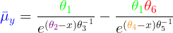

## Introduction

I thought I would share some old code I stumbled upon for fitting Bayesian Nonlinear mixed effect (NLME) models with Stan and R. The model code can be found in the `non_linear.stan` file or at the bottom of this README. The models presented here are taken from or adapted from work presented by Pinheiro and Bates' (2000) book [*Nonlinear Mixed-Effects Models in S and S-PLUS*](https://link.springer.com/book/10.1007/b98882), which remains an excellent resource for anyone wanting a deep-dive into the background of nonlinear models and methods for their estimation.

Nonlinear models are wonderful tools for parametric modeling of diverse phenomena, with applications spanning numerous academic disciplines. From my experience, I find that these models are particularly well-suited for time series data due to their flexibility, which can capture chages in characteristic rates over segments of a curve, and the ease with which model parameters can be interpreted. For example, in many cases, model parameters will correspond to important locations along the support axis where the inflection points or other key features of a curve are estimated to occur. Pinheiro and Bates (2000) also show that these models can be easily extended to incorporate hierachical data structures. For these reasons, I generally prefer nonlinear mixed-effect models over non-parametric methods for fitting nonlinear curves, such as splines or generalized additive models.

In the past, a major drawback of NLMEs was that they could be difficult to fit using maximum likelihood and related methods, due to the multimodal nature of the posterior distribution. Often times, fitting these models also required informative starting values or specialized functions to automatically search a grid of potential starting values in order to initialize the optimization algorithm from a favorable region of the parameter space. 

Advances in Bayesian estimation since Pinheiro and Bates' (2000) book have largely circumvented these issues. The latest MCMC sampling algorithms (e.g., No-U-Turn and Hamiltonian Monte Carlo) are capable of efficiently exploring the parameter space of even poorly behaved model posteriors, and can provide reliable estimates of random-effect parameters. Relatedly, Bayesian estimation of NLME models is also less sensitive to poor choices of starting values, as the sampler can be expected to quickly move away from regions of lower posterior density.

Each of the models presented here are variations of the logistic (sigmoid) curve:

* Three Paramters: The standard logistic curve with multilevel parameters
* Five Parameters: Two logistic curves added together, with differing rates and inflection points but a shared upper *y* limit
* Six Parameters: Two logistic curves added together, with differing rates, inflection points, and *y* values of their lower asymptote(s)

The parameters of the logistic curves ("thetas") are modeled as random-effects:


Here, *I* is the number of clusters in the dataset, *K* is the number of parameters in the curve function, and *y* is the *t*-th observation of the dependent variable for the *i*-th cluster.

The Stan model used here also uses non-centering for estimation of multilevel parameters. More details about non-centering and how it can improve model fitting are described in [Chapter 22.7 of the Stan Language Manual](https://mc-stan.org/docs/2_24/stan-users-guide/reparameterization-section.html).
  
The models were estimated using Stan and RStan API package for R. Before launching into model-fitting, some critical packages need to be loaded and hyperparameter options need to be set.

```{r setup}
library(rstan)
library(ggplot2)
library(tidyverse)
library(datasets)
library(HDInterval)
library(reshape)

#Define Stan model fitting options
rstan_options(auto_write = TRUE) #saves compiled stan model to storage
options(mc.cores = parallel::detectCores()) #uses multicore processing

#Parameters to monitor
sample_pars <-
  c("theta_i", #random-effects
    "theta_mean", #pop. mean
    "sigma_theta", #pop. var
    "sigma", #y var
    "y_hat", #model predicted y
    "log_lik") #model log-likelihood

#NUTS algorithm hyperparameters
control. <- list(
  adapt_engaged = TRUE,
  adapt_delta = 0.9, #increased from default of 0.8
  stepsize = 0.01,
  max_treedepth = 10
)
```

## Three Parameter Model

The traditional logistic curve is used for modeling all sorts of data, and you may also recognize it as the same function used as the activation for an output layer of a neural net binary classifier. One area where logistic curves are commonly applied is to model the growth trajectories of plants and animals. Many mammals in particualar exhibit patterns of growth from birth to maturation resembling sigmoid curves: an initial period of slow, steady growth followed by a intermediate stage of rapid development that eventually slows before ceasing around the age of adulthood (i.e., the upper asymptote of the curve). 

Here I give an example using longitudinal observations of individual Loblolly pine trees. The data for this task come from the `datasets` package. Tree height measurements were collected from 14 individual trees at 3, 5, 10, 15, 20, and 25 years of age.

```{r logi_3 data}
data("Loblolly")
d <- tibble(Loblolly)

qplot(x=age, y=height, color=Seed, data=d)
```

As you can see, we have repeated measurements of the same individuals ("Seed") over time. These data are just begging to be fit to a NLME model, with individuals as the random effect. To fit these observations to our Stan model, we need to do put the data into a list for Stan and give the sampler some good starting values to help get things going.

```{r logistic3_fit, warning=FALSE}
stan_data <- list(
  N = nrow(d),
  I = length(unique(d$Seed)),
  id = as.numeric(factor(d$Seed)),
  K = 3,
  x = d$age,
  y = d$height
)

#Function to pass initial values
initList <- function(chain_id){
  list(
    "theta_mean[1]" = rep(log(60), stan_data$I),
    "theta_mean[2]" = rep(log(12), stan_data$I),
    "theta_mean[3]" = rep(log(1.5), stan_data$I)
  )
}

fit_3 <- stan(
  file = "non_linear.stan",
  data = stan_data,
  iter = 6e2, 
  warmup = 5e2,
  thin = 1,
  chains = 3,
  seed = 22,
  init = initList,
  pars = sample_pars,
  control = control.
)

```

Now that the model is fitted, let's do some quick visual checks of the predictions against the raw observations.

```{r logistic3_plot, warning=FALSE, fig.align="center"}
#Define function for convenience
logistic3 <- function(t1, t2, t3, x){
  t1/(1+exp((t2-x)/t3))
}

#Get posterior samples from fitted model
post <- as.matrix(fit_3) %>% 
  data.frame()

#Get population average theta parameters
pars <- sprintf("theta_mean.%s.", 1:3)
thetas <- exp(post[,pars])

#Get predictions for input values
xs <- seq(0, 30)

#Estimated mean growth curve
y_est <- sapply(xs, function(x) logistic3(t1=thetas[,1], t2=thetas[,2], t3=thetas[,3], x = x) ) %>%
  colMeans

#Credible intervals for mean growth curve
y_ci <- sapply(xs, function(x) logistic3(t1=thetas[,1], t2=thetas[,2], t3=thetas[,3], x = x)) %>%
  HDInterval::hdi(0.95)

#Plotting data
dy = cbind(xs,y_est, t(y_ci)) %>%
  data.frame()

#Create plot
ggplot() +
  theme_light() +
  ggtitle("3-Parameter Logistic Model", subtitle = "Loblolly Pine Tree Growth Curve") +
  # geom_line(data=dy_i, aes(x=age, y=height, group=id), color="gray70", size=0.5) +
  geom_vline(xintercept=mean(thetas$theta_mean.2.), linetype=1, size=0.5, color="purple") +
  geom_vline(xintercept=hdi(thetas$theta_mean.2.)[1], linetype=2, size=0.5, color="purple") +
  geom_vline(xintercept=hdi(thetas$theta_mean.2.)[2], linetype=2, size=0.5, color="purple") +
  geom_hline(yintercept=mean(thetas$theta_mean.1.), linetype=1, size=0.5, color="green") +
  geom_hline(yintercept=hdi(thetas$theta_mean.1.)[1], linetype=2, size=0.5, color="green") +
  geom_hline(yintercept=hdi(thetas$theta_mean.1.)[2], linetype=2, size=0.5, color="green") +
  geom_line(data=dy, aes(x=xs, y=y_est), color="blue") +
  geom_ribbon(data=dy, aes(x=xs, ymin=lower, ymax=upper), fill=alpha("white",0), color="blue", linetype=2, size=0.5) +
  geom_point(data=d, aes(x=age, y=height), color="gray10", shape=1, size=1) +
  scale_x_continuous("Age (yr)") +
  scale_y_continuous("Height (ft)")
```

```{r logi_3_indv, include=FALSE}
#Data frame for plotting
y_i = list()
for(i in 1:stan_data$I){
  pars <- sprintf("theta_i.%s.%s.", i, 1:3)
  thetas_i <- post[,pars]
  y_i[[i]] <- sapply(xs, function(x) logistic3(t1=thetas_i[,1], t2=thetas_i[,2], t3=thetas_i[,3], x = x) ) %>%
  colMeans
}
dy_i <- y_i %>% 
  do.call("rbind",.) %>%
  melt()
names(dy_i) <- c("Seed", "age", "height")
dy_i$Seed = ordered(dy_i$Seed)

ggplot() +
  theme_light() +
  ggtitle("3-Parameter Logistic Model", subtitle = "Individual Loblolly Pine Tree Growth Curves") +
  geom_line(data=dy_i, aes(x=age, y=height, color=Seed), size=0.5) +
  geom_point(data=d, aes(x=age, y=height, color=Seed), shape=1, size=1) +
  scale_x_continuous("Age (yr)") +
  scale_y_continuous("Height (ft)")
```


The average logistic growth curve (blue) does an 'ok' job of fitting to the pine tree growth data, although it tends to overestimate the predicted height of trees at early stages of development and under-predict heights at intermediate stages (e.g, around 10 years of age). As mentioned before, interpreting the model parameters in light of the original data is a cinch, requiring no transformations back to an original scale. For example, the population of mean of $\bar{\theta}_1$ (green) corresponds to the predicted upper limit of the height of Lolbolly pine trees, which is estimated here to be 61.4 feet (95% highest posterior density interval: 59.0-65.4). Growth is most rapid near the midpoint of the curve, and the coordinate position of this point on the x-axis is given from the parameter $\bar{\theta}_2$ (purple). This model predicts that the midpoint of tree growth occurs at roughly 11.8 years (95% HPDI: 11.3-12.3) of age.

## Five Parameter Model

The five parameter logistic model is actually the difference of two logistic curves, each sharing a common upper *y* limit but different characteristic growth rates and midpoints. First, I will generate some fake data, with random noise, in order to illustrate what such a curve might appear like.

```{r logistic5_example, warning=FALSE, fig.align="center"}

#Five parameter logistic function with random noise (tau) parameter
logistic5 <- function(t1, t2, t3, t4, t5, x, tau){
  y <- t1/(1+exp((t2-x)/t3)) - t1/(1+exp((t4-x)/t5))
  y <- y + rnorm(length(x), 0, tau)
  y
}

#Generate data from this function
y_data = list()
n_curves = 20
for(i in 1:n_curves){
  set.seed(i^2)
  x = seq(0, 100, by = 2) #x-axis values
  t1 = 55
  t2 = 25
  t3 = 2
  t4 = 75
  t5 = 2.5
  y_data[[i]] = logistic5(t1, t2, t3, t4, t5, x, tau = 2)
}

y_data <- y_data  %>% 
  melt() %>%
  mutate(x=rep(seq(0, 100, by = 2), times=20))
names(y_data) <- c("y","id","x")
y_data$y <- y_data$y - min(y_data$y)
qplot(x=x, y=y, data=y_data, group=id)
```

[Papworth et al. (2012)](https://besjournals.onlinelibrary.wiley.com/doi/10.1111/j.2041-210X.2012.00189.x) used such a model to examine the movement behavior of human central-place foragers, with the net displacement of individuals from the location of their home over the course of a given day serving as the dependent variable for the analysis. From their fitted model parameters, the authors of the study were then able to determine how the choice of foraging routes influenced the timing, maximum displacement, and degree of individual variation in observed movement behavior.

Here, I fit the Stan model to the example data generated above. Again, we must first put our data into a list for Stan before running the model.

```{r logistic5_fit, warning=FALSE}
stan_data <- list(
  N = nrow(y_data),
  I = max(y_data$id),
  id = y_data$id,
  K = 5,
  x = y_data$x,
  y = y_data$y
)

#Function to pass initial values. 
#Compare to values used to generate example data.
initList <- function(chain_id){
  list(
    "theta_mean[1]" = rep(log(55), stan_data$I),
    "theta_mean[2]" = rep(log(10), stan_data$I),
    "theta_mean[3]" = rep(log(3), stan_data$I),
    "theta_mean[4]" = rep(log(65), stan_data$I),
    "theta_mean[5]" = rep(log(5), stan_data$I)
  )
}

fit_5 <- stan(
  file = "non_linear.stan",
  data = stan_data,
  iter = 6e2, 
  warmup = 5e2,
  thin = 1,
  chains = 3,
  seed = 12,
  init = initList,
  pars = sample_pars,
  control = control.
)
```

Using the `logistic5` function defined above and samples from the posterior, check the fit of the model against observed values.

```{r logistic5_plot, fig.align="center"}
#Get posterior samples from fitted model
post <- as.matrix(fit_5) %>% 
  data.frame()

#get theta params
pars <- sprintf("theta_mean.%s.", 1:5)
thetas <- exp(post[,pars])
  
## Get predictions from input values
xs <- seq(0, 100, 2)

#Estimated mean growth curve
y_est <-
  sapply(xs, function(x)
    logistic5(
      t1 = thetas[, 1],
      t2 = thetas[, 2],
      t3 = thetas[, 3],
      t4 = thetas[, 4],
      t5 = thetas[, 5],
      x = x,
      0
    )) %>% 
  colMeans

#Credible intervals of mean growth curve
y_ci <-
  sapply(xs, function(x)
    logistic5(
      t1 = thetas[, 1],
      t2 = thetas[, 2],
      t3 = thetas[, 3],
      t4 = thetas[, 4],
      t5 = thetas[, 5],
      x = x,
      0
    )) %>%
  hdi(0.95)

#Plotting data
dy = cbind(xs,y_est, t(y_ci)) %>%
  data.frame()

#Create plot
ggplot() +
  theme_light() +
  ggtitle("5-Parameter Logistic Model") +
  geom_point(data=y_data, aes(x=x, y=y), shape=1, size=1) +
  geom_hline(yintercept=mean(thetas$theta_mean.1.), linetype=1, size=0.5, color="green") +
  geom_hline(yintercept=hdi(thetas$theta_mean.1.)[1], linetype=2, size=0.5, color="green") +
  geom_hline(yintercept=hdi(thetas$theta_mean.1.)[2], linetype=2, size=0.5, color="green") +
  geom_vline(xintercept=mean(thetas$theta_mean.2.), linetype=1, size=0.5, color="purple") +
  geom_vline(xintercept=hdi(thetas$theta_mean.2.)[1], linetype=2, size=0.5, color="purple") +
  geom_vline(xintercept=hdi(thetas$theta_mean.2.)[2], linetype=2, size=0.5, color="purple") +
  geom_vline(xintercept=mean(thetas$theta_mean.4.), linetype=1, size=0.5, color="orange2") +
  geom_vline(xintercept=hdi(thetas$theta_mean.4.)[1], linetype=2, size=0.5, color="orange2") +
  geom_vline(xintercept=hdi(thetas$theta_mean.4.)[2], linetype=2, size=0.5, color="orange2") +
  geom_line(data=dy, aes(x=xs, y=y_est), color="blue") +
  geom_ribbon(data=dy, aes(x=xs, ymin=lower, ymax=upper), fill=alpha("white",0), color="blue", linetype=2, size=0.5) +
  scale_color_manual("", values=c("gray10", "gray10")) +
  scale_x_continuous("y") +
  scale_y_continuous("x")
```


## Six Parameter Model

This version is actually a modified version of the five parameter model, and was not included in Pinheiro and Bates (2000). Like the previous model, the function is simply two logistic curves added together, but with an extra parameter $\theta_6 > 0$ that adjusts the location of the lower asymptote on the right curve relative to the position of the lower asymptote of the left curve. As before, I will generate some example data, with added random noise, and fit the model.

```{r logi_6_data, fig.align="center"}

logistic6 <- function(t1, t2, t3, t4, t5, t6, x, tau){
  y <- t1/(1+exp((t2-x)/t3)) - (t6*t1)/(1+exp((t4-x)/t5))
  y <- y + rnorm(length(x), 0, tau)
  y
}

y_data = list()
n_curves = 20
for(i in 1:n_curves){
  set.seed(i^6)
  x = seq(0, 100, by = 2) #x-axis values
  t1 = 55
  t2 = 10
  t3 = 2
  t4 = 65
  t5 = 4
  t6 = 0.5
  y_data[[i]] = logistic6(t1, t2, t3, t4, t5, t6, x, 2)
}

y_data <- y_data  %>% 
  melt() %>%
  mutate(x=rep(seq(0, 100, by = 2), times=20))
names(y_data) <- c("y","id","x")
y_data$y <- y_data$y - min(y_data$y)
qplot(x=x, y=y, data=y_data, group=id)
```

```{r logistic6_fit, echo=FALSE, warning=FALSE}
stan_data <- list(
  N = nrow(y_data),
  I = max(y_data$id),
  id = y_data$id,
  K = 6,
  x = y_data$x,
  y = y_data$y
)

#Function to pass initial values
initList <- function(chain_id){
  list(
    "theta[1]" = rep(log(50), stan_data$I),
    "theta[2]" = rep(log(1), stan_data$I),
    "theta[3]" = rep(log(10), stan_data$I),
    "theta[4]" = rep(log(50), stan_data$I),
    "theta[5]" = rep(log(10), stan_data$I),
    "theta[6]" = rep(log(0.5), stan_data$I)
  )
}

fit_6 <- stan(
  file = "non_linear.stan",
  data = stan_data,
  iter = 6e2, 
  warmup = 5e2,
  thin = 1,
  chains = 3,
  seed = 2,
  init = initList,
  pars = sample_pars,
  control = control.
)

```

```{r logistic6_plot, fig.align="center"}
#Get posterior samples from fitted model
post <- as.matrix(fit_6) %>% data.frame()
#get theta params
pars <- sprintf("theta_mean.%s.", 1:6)
thetas <- exp(post[,pars])
  

## Get predictions from input values
xs <- seq(0, 100, 2)

#Estimated mean growth curve
y_est <-
  sapply(xs, function(x)
    logistic6(
      t1 = thetas[, 1],
      t2 = thetas[, 2],
      t3 = thetas[, 3],
      t4 = thetas[, 4],
      t5 = thetas[, 5],
      t6 = thetas[, 6],
      x = x,
      0
    )) %>%
  colMeans

#Credible intervals for mean growth curve
y_ci <-
  sapply(xs, function(x)
    logistic6(
      t1 = thetas[, 1],
      t2 = thetas[, 2],
      t3 = thetas[, 3],
      t4 = thetas[, 4],
      t5 = thetas[, 5],
      t6 = thetas[, 6],
      x = x,
      0
    )) %>%
  hdi(0.95)


dy = cbind(xs,y_est, t(y_ci)) %>%
  data.frame()

ggplot() +
  theme_light() +
  ggtitle("6-Parameter Logistic Model") +
  geom_hline(yintercept=mean(thetas$theta_mean.1.), linetype=1, size=0.5, color="green") +
  geom_hline(yintercept=hdi(thetas$theta_mean.1.)[1], linetype=2, size=0.5, color="green") +
  geom_hline(yintercept=hdi(thetas$theta_mean.1.)[2], linetype=2, size=0.5, color="green") +
  geom_hline(yintercept=mean(thetas$theta_mean.6.*thetas$theta_mean.1.), linetype=1, size=0.5, color="red") +
  geom_hline(yintercept=hdi(thetas$theta_mean.6.*thetas$theta_mean.1.)[1], linetype=2, size=0.5, color="red") +
  geom_hline(yintercept=hdi(thetas$theta_mean.6.*thetas$theta_mean.1.)[2], linetype=2, size=0.5, color="red") +
  geom_vline(xintercept=mean(thetas$theta_mean.2.), linetype=1, size=0.5, color="purple") +
  geom_vline(xintercept=hdi(thetas$theta_mean.2.)[1], linetype=2, size=0.5, color="purple") +
  geom_vline(xintercept=hdi(thetas$theta_mean.2.)[2], linetype=2, size=0.5, color="purple") +
  geom_vline(xintercept=mean(thetas$theta_mean.4.), linetype=1, size=0.5, color="orange2") +
  geom_vline(xintercept=hdi(thetas$theta_mean.4.)[1], linetype=2, size=0.5, color="orange2") +
  geom_vline(xintercept=hdi(thetas$theta_mean.4.)[2], linetype=2, size=0.5, color="orange2") +
  geom_line(data=dy, aes(x=xs, y=y_est), color="blue") +
  geom_ribbon(data=dy, aes(x=xs, ymin=lower, ymax=upper), fill=alpha("white",0), color="blue", linetype=2, size=0.5) +
  geom_point(data=y_data, aes(x=x, y=y), color="gray10", shape=1, size=1) +
  scale_x_continuous("x") +
  scale_y_continuous("y")
```


## Five or Six Parameters?

In some cases, it may be difficult to tell at a glance whether a five or six parameter curve is more appropriate for our data. In certain cases, the five parameter model could suffice without the potential for overfitting. However, the six-parameter version might also be considered for reasons related to the data generating process, where a better fit to the more complex model could serve as evidence in support of a hypothesis concerning the generating process.

One approach is to fit the same data to both models, and then assess their relative fit using an information criterion. In the calculation of many information criteria, there is a penalty for adding more parameters to a model that can lead to overfitting of the data. Information criteria like WAIC can often be calculated from the posterior log-likelihood of the fitted models. In the Stan model, the value of the log-likelihood is sampled from the `generated quantities` block. We can then define an R function to calculate the model WAIC directly from the `stanfit` object.

```{r waic}
#Returns lppd, p_waic_1, p_waic_2, and waic
colVars <- function (a){
  diff <- a - matrix (colMeans(a), nrow(a), ncol(a), byrow=TRUE)
  vars <- colMeans (diff^2)*nrow(a)/(nrow(a)-1)
  return (vars)
}

waic <- function (stanfit){
  log_lik <- rstan::extract (stanfit, "log_lik")$log_lik
  lppd <- sum (log (colMeans(exp(log_lik))))
  p_waic_1 <- 2*sum (log(colMeans(exp(log_lik))) - colMeans(log_lik))
  p_waic_2 <- sum (colVars(log_lik))
  waic_2 <- -2*lppd + 2*p_waic_2
  return (list (waic=waic_2, p_waic=p_waic_2, lppd=lppd, p_waic_1=p_waic_1))
}

```

The simulated generating process used here is intended to fit best to a six-parameter logistic curve, but whose shape will also be reasonably approximated by the five-parameter model. This is achieved by setting the value of $\theta_6 = 0.9$.

```{r waic_data}
#Generate data from this function
x <- seq(0, 100, by = 2) #x-axis values
y_data = list()
n_curves <- 20
for(i in 1:n_curves){
  set.seed(i^2)
  x = x
  t1 = 55
  t2 = 25
  t3 = 2
  t4 = 75
  t5 = 2.5
  t6 = 0.9
  y_data[[i]] = logistic6(t1, t2, t3, t4, t5, t6, x, tau = 2)
}

y_data <- y_data  %>% 
  melt() %>%
  mutate(x=rep(seq(0, 100, by = 2), times=20))
names(y_data) <- c("y","id","x")
y_data$y <- y_data$y - min(y_data$y)
qplot(x=x, y=y, data=y_data, group=id)
```

Now, these data are fitted to both the five and six parameter models. Note, all that is needed is to change the value of `stan_data$K` from 5 to 6.
```{r waic_fit, warning=FALSE}

stan_data <- list(
  N = nrow(y_data),
  I = max(y_data$id),
  id = y_data$id,
  K = 5,
  x = y_data$x,
  y = y_data$y
)

five <- stan(
  file = "non_linear.stan",
  data = stan_data,
  iter = 6e2, 
  warmup = 5e2,
  thin = 1,
  chains = 3,
  seed = 2,
  init = initList,
  pars = sample_pars,
  control = control.
)

stan_data$K <- 6
six <- stan(
  file = "non_linear.stan",
  data = stan_data,
  iter = 6e2, 
  warmup = 5e2,
  thin = 1,
  chains = 3,
  seed = 2,
  init = initList,
  pars = sample_pars,
  control = control.
)
```

```{r waic_plot}

post5 <- as.matrix(five) %>% 
  data.frame()
post6 <- as.matrix(six) %>% 
  data.frame()

#get theta params
thetas5 <- exp(post5[, sprintf("theta_mean.%s.", 1:5)])
thetas6 <- exp(post6[, sprintf("theta_mean.%s.", 1:6)])

## Get predictions from input values
xs <- seq(0, 100, 2)

#Estimated mean growth curve
y_est5 <-
  sapply(xs, function(x)
    logistic5(
      t1 = thetas5[, 1],
      t2 = thetas5[, 2],
      t3 = thetas5[, 3],
      t4 = thetas5[, 4],
      t5 = thetas5[, 5],
      x = x,
      0
    )) %>%
  colMeans

y_est6 <-
  sapply(xs, function(x)
    logistic6(
      t1 = thetas6[, 1],
      t2 = thetas6[, 2],
      t3 = thetas6[, 3],
      t4 = thetas6[, 4],
      t5 = thetas6[, 5],
      t6 = thetas6[, 6],
      x = x,
      0
    )) %>%
  colMeans

#Credible intervals for mean growth curve
y_ci5 <-
  sapply(xs, function(x)
    logistic5(
      t1 = thetas5[, 1],
      t2 = thetas5[, 2],
      t3 = thetas5[, 3],
      t4 = thetas5[, 4],
      t5 = thetas5[, 5],
      x = x,
      0
    )) %>%
  hdi(0.95)

y_ci6 <-
  sapply(xs, function(x)
    logistic6(
      t1 = thetas6[, 1],
      t2 = thetas6[, 2],
      t3 = thetas6[, 3],
      t4 = thetas6[, 4],
      t5 = thetas6[, 5],
      t6 = thetas6[, 6],
      x = x,
      0
    )) %>%
  hdi(0.95)

dy = cbind(xs,
           c(y_est5, y_est6), 
           t(cbind(y_ci5, y_ci6))
           ) %>%
  data.frame()
dy$model <- rep(c("Five","Six"), each = nrow(dy)/2)
names(dy) <- c("x","y","lower","upper","model")

ggplot() +
  theme_light() +
  ggtitle("5- and 6-Parameter Logistic Models") +
  geom_line(data=dy, aes(x=x, y=y, color=model)) +
  geom_ribbon(data=dy, aes(x=x, ymin=lower, ymax=upper, color=model), fill=alpha("white",0), linetype=2, size=0.5, show.legend = FALSE) +
  geom_point(data=y_data, aes(x=x, y=y), color="gray10", shape=1, size=1) +
  scale_color_viridis_d(begin = 0.2, end=0.8) +
  scale_x_continuous("x") +
  scale_y_continuous("y")
```

The model with six parameters (for added flexibility) appears to fit the data better, as intended. But intuition is no match for the types of insights that can be obtained from such heady fields as information theory (right?).

Using the functions we defined before, we can also assess the relative fit of each model using their WAIC scores.
```{r waic_calc}
sapply(list(five, six), waic) %>% 
  t()

```

From this table, we see that the six parameter model provides a better relative fit to the data (**WAIC = 4751**) than the five parameter alternative (**WAIC = 5762**), despite the greater complexity.

## Stan Code
The raw Stan code for fitting the 3-, 5-, and 6-parameter logistic growth curves.

```
functions{
  
  real logistic3(real x, vector theta){
    /* 
    -3 parameter logistic function-
    theta[1] is the upper y-asymptote
    theta[2] is the x-coordinate of the first inflection point
    theta[3] is the rate parameter (stepness of curve)
    */
    real y;
    y = theta[1] / (1+exp((theta[2]-x)/theta[3]));
    return y;
  }
  
  real logistic5(real x, vector theta){
    /* 
    -5 parameter logistic function-
    theta[1] is the upper y-asym-ptote
    theta[2] is the x-coordinate of the first inflection point
    theta[3] is the first growth rate parameter
    theta[4] is the x-coordinate of the second inflection point
    theta[5] is the second growth rate parameter
    */
    real y;
    y = theta[1] / (1+exp((theta[2]-x)/theta[3])) - 
        theta[1] / (1+exp((theta[4]-x)/theta[5]));
    return y;
  }
  
  real logistic6(real x, vector theta){
    /*
    -6 parameter logistic function-
    theta[1] is the upper y-asymptote
    theta[2] is the x-coordinate of the first inflection point
    theta[3] is the first growth rate parameter
    theta[4] is the x-coordinate of the second inflection point
    theta[5] is the second growth rate parameter
    theta[6] is related to the value of the second lower asymptote
    */
    real y;
    y = theta[1] / (1+exp((theta[2]-x)/theta[3])) - 
        (theta[1]*theta[6]) / (1+exp((theta[4]-x)/theta[5]));
    return y;
  }

  real logisticN(real x, vector theta){
    /* 
    Wrapper function for all NLME models. The size of the parameter vector is checked, 
    which determines the function to call.
    */
    int K = rows(theta);
    real y;
    if(K == 3){
      y = logistic3(x, theta);
    }
    if(K == 5){
      y = logistic5(x, theta);
    }
    if(K == 6){
      y = logistic6(x, theta);
    }
    return y;
  }
  
  vector nc_exp(vector mu, vector sigma, vector nu){
    /* "Non-centering"" decomposition for multilevel parameters
    mu_i = mu + sigma * nu
    nu ~ normal(0, 1)
    Same as: mu_i ~ normal(mu, sigma)
    See: https://mc-stan.org/docs/2_24/stan-users-guide/reparameterization-section.html
    */
    return exp(mu + sigma .* nu);
  }
  
  vector nc_linear(vector mu, vector sigma, vector nu){
    /* "Non-centering"" decomposition for multilevel parameters
    mu_i = mu + sigma * nu
    nu ~ normal(0, 1)
    Same as: mu_i ~ normal(mu, sigma)
    See: https://mc-stan.org/docs/2_24/stan-users-guide/reparameterization-section.html
    */
    return mu + sigma .* nu;
  }

}

data{
  
  int N; // total num obs
  int K; // number parameters
  int I; // number of clusters
  int id[N]; //index of cluster id
  vector[N] x;
  vector[N] y;
  
}

parameters{
  
  real<lower=0> sigma; // error
  vector[K] theta_mean; // pop. mean
  vector<lower=0>[K] sigma_theta; // pop. var
  vector[K] theta_norm[I]; // unit normals

}

transformed parameters{
  
  vector<lower=0>[K] theta_i[I]; // random effect coefficients
  
  for(i in 1:I){
    theta_i[i] = nc_exp(theta_mean, sigma_theta, theta_norm[i]);
  }

}

model{
  
  // loop over observations
  for(n in 1:N){
    real mu = logisticN(x[n], theta_i[id[n]]);
    target += normal_lpdf(y[n] | mu, sigma); // increment log prob
  }
    
  // priors
  theta_mean ~ normal(0, 1);
  sigma ~ normal(0, 1);
  sigma_theta ~ normal(0, 1);
  for(i in 1:I){
    theta_norm[i] ~ normal(0, 1);
  }
  
}

generated quantities{

  vector[N] y_hat; // predicted values
  vector[N] log_lik; // log-likelihood

  for(n in 1:N){
    real mu;
    mu = logisticN(x[n], theta_i[id[n]]);
    y_hat[n] = normal_rng(mu, sigma);
    log_lik[n] = normal_lpdf(y[n] | logisticN(x[n], theta_i[id[n]]), sigma);
  }

}
```
## References

1. Pinheiro, José C, and Douglas M. Bates. Mixed-effects Models in S and S-Plus. New York: Springer, 2000.

2. Papworth, S.K., Bunnefeld, N., Slocombe, K. and Milner‐Gulland, E.J. (2012), Movement ecology of human resource users: using net squared displacement, biased random bridges and resource utilization functions to quantify hunter and gatherer behaviour. Methods in Ecology and Evolution, 3: 584-594. doi:10.1111/j.2041-210X.2012.00189.x

3. Stan Development Team. 2018. Stan Modeling Language Users Guide and Reference Manual, Version 2.18.0.   http://mc-stan.org
