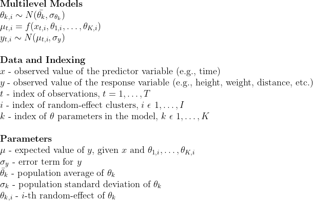
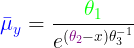
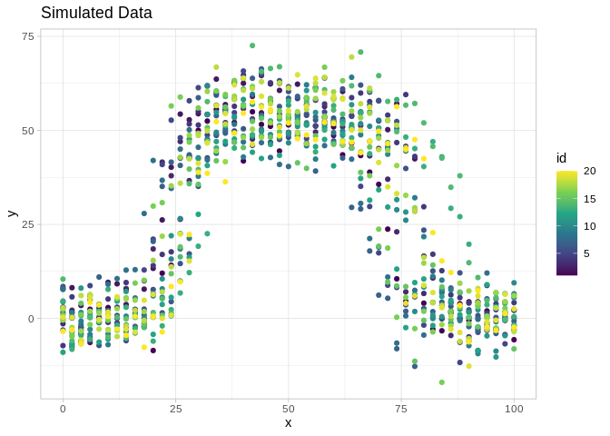
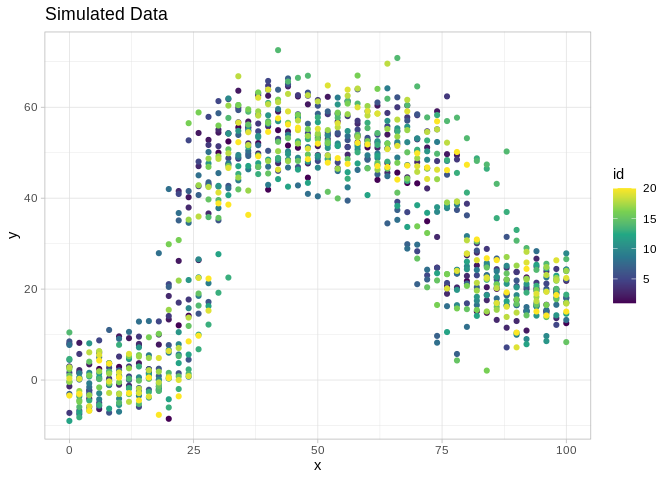
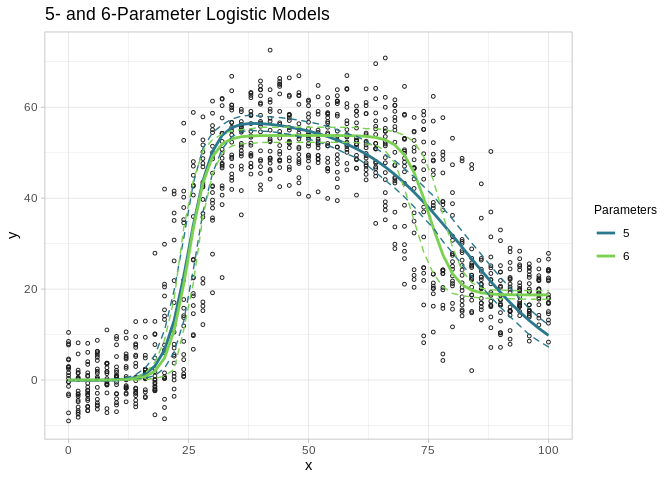
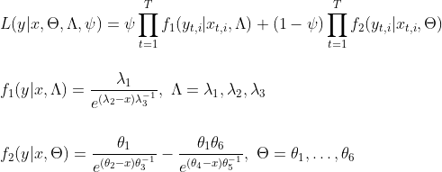
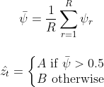
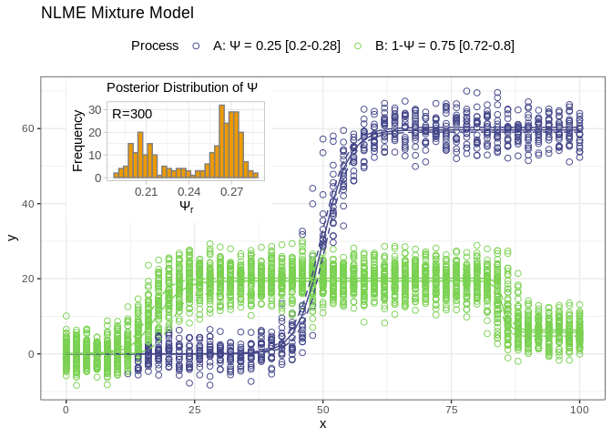

Bayesian Nonlinear Mixed-Effects Models in Stan
================

## Introduction

I thought I would share some old code I stumbled upon for fitting
Bayesian Nonlinear mixed-effect (NLME) models with Stan and R. The model
code can be found in the `non_linear.stan` file. The models presented
here are taken from or adapted from work presented in Pinheiro and
Bates’ (2000) book [*Nonlinear Mixed-Effects Models in S and
S-PLUS*](https://link.springer.com/book/10.1007/b98882), which remains
an excellent resource for anyone wanting a deep-dive into the background
of nonlinear models and methods for their estimation.

Nonlinear models are wonderful tools for parametric modeling of diverse
phenomena, with applications spanning numerous academic disciplines. I
have found that these models are particularly well-suited for time
series data due to their flexibility, which can capture chages in
characteristic rates over segments of a curve, and the ease with which
the model parameters can be interpreted. For example, in many cases,
model parameters will correspond to important locations along the
support axis where the midpoint or other key features of a logistic
curve occur. Pinheiro and Bates (2000) also show that these models can
be easily extended to incorporate hierarchical data structures. For
these reasons, I generally prefer NLME models over non-parametric
methods for fitting nonlinear curves, such as splines or generalized
additive models.

In the past, a major drawback of NLMEs was that they could be difficult
to fit using maximum likelihood or related optimization methods due to
the multimodal nature of the posterior distributions. As a result, the
posteriors of nonlinear models specifically, and multilevel models more
generally, often defy the common assumption of these methods that the
posterior can be approximated by Gaussian distributions. Furthermore,
fitting these models also required providing the optimization algorithm
with informative starting values or by using specialized functions to
search a grid of potential starting values to locate a favorable region
of the parameter space to begin optimization (see `nlme::SSlogis`).

Advances in Bayesian estimation since Pinheiro and Bates’ (2000) book
have largely circumvented these issues. The latest MCMC sampling
algorithms (e.g., No-U-Turn and Hamiltonian Monte Carlo) are capable of
efficiently exploring the parameter space of even poorly behaved (i.e.,
multimodal and non-Gaussian) model posteriors, and can therefore provide
reliable estimates of multilevel parameters. Additionally, Bayesian
estimation of NLME models may also be less sensitive to poor choices of
starting values. Using Stan, potential starting values for the algorithm
are sampled from a parameter’s prior distribution (if none are provided
by the user), and repeated attempts will be made if a set of values
happens to be in region of the parameter space where the gradient cannot
be calculated. In my experience, the program will find acceptable
starting values within 5-10 attempts, and that a failure to find a set
of starting values in the default number of attempts usually indicates a
problem with the model itself.

In the following sections I will cover:

  - Model fitting and evaluation with RStan
  - Model comparisons with WAIC
  - Mixture models with nonlinear mixed-effect components

## Model Fitting

Each of the models presented here are variations of the logistic
(sigmoid) curve:

  - Three Parameters: The standard logistic curve with multilevel
    parameters
  - Five Parameters: Two logistic curves added together, with differing
    rates and midpoints but a shared upper *y* limit
  - Six Parameters: Two logistic curves added together, with differing
    rates, midpoints, and *y* values of their lower asymptote(s)

The parameters of the logistic curves (𝜃) are modeled as random-effects.



The Stan model used here also uses non-centering for estimation of the
multilevel parameters. More details about non-centering and how it can
improve model fitting are described in [Chapter 22.7 of the Stan
Language
Manual](https://mc-stan.org/docs/2_24/stan-users-guide/reparameterization-section.html).

All models were estimated using Stan and RStan API package for R. Before
launching into model-fitting, some critical packages need to be loaded
and hyperparameter options
    set.

``` r
library(rstan)
```

    ## Loading required package: StanHeaders

    ## Loading required package: ggplot2

    ## rstan (Version 2.19.2, GitRev: 2e1f913d3ca3)

    ## For execution on a local, multicore CPU with excess RAM we recommend calling
    ## options(mc.cores = parallel::detectCores()).
    ## To avoid recompilation of unchanged Stan programs, we recommend calling
    ## rstan_options(auto_write = TRUE)

``` r
library(ggplot2)
library(ggplotify)
library(tidyverse)
```

    ## ── Attaching packages ────────────────────────────────────────────────────────────────────── tidyverse 1.3.0 ──

    ## ✓ tibble  3.0.1     ✓ dplyr   0.8.5
    ## ✓ tidyr   1.0.3     ✓ stringr 1.4.0
    ## ✓ readr   1.3.1     ✓ forcats 0.5.0
    ## ✓ purrr   0.3.4

    ## ── Conflicts ───────────────────────────────────────────────────────────────────────── tidyverse_conflicts() ──
    ## x tidyr::extract() masks rstan::extract()
    ## x dplyr::filter()  masks stats::filter()
    ## x dplyr::lag()     masks stats::lag()

``` r
library(datasets)
library(HDInterval)
library(reshape)
```

    ## 
    ## Attaching package: 'reshape'

    ## The following object is masked from 'package:dplyr':
    ## 
    ##     rename

    ## The following objects are masked from 'package:tidyr':
    ## 
    ##     expand, smiths

``` r
library(caret)
```

    ## Loading required package: lattice

    ## 
    ## Attaching package: 'caret'

    ## The following object is masked from 'package:purrr':
    ## 
    ##     lift

``` r
#Define Stan model fitting options
rstan_options(auto_write = TRUE) #saves compiled stan model to storage
options(mc.cores = parallel::detectCores()) #uses   multicore processing

#Parameters to monitor
sample_pars <-
  c("theta_i", #random-effects
    "theta_mean", #pop. mean
    "sigma_theta", #pop. var
    "sigma", #y var
    "y_hat", #model predicted y
    "log_lik") #model log-likelihood

#NUTS algorithm hyperparameters
control. <- list(
  adapt_engaged = TRUE,
  adapt_delta = 0.9, #increased from default of 0.8
  stepsize = 0.01,
  max_treedepth = 10
)
```

### Three Parameter Model

The traditional logistic curve is used for modeling all sorts of data,
and you may also recognize it as the same function used as the
activation for an output layer of a neural net binary classifier. One
area where logistic curves are commonly applied is to model the growth
trajectories of plants and animals. Many mammals in particular exhibit
patterns of growth from birth to maturation resembling sigmoid curves:
an initial period of slow, steady growth followed by a intermediate
stage of rapid development that eventually slows before ceasing around
the age of adulthood (i.e., the upper asymptote of the curve).

Here I give an example using longitudinal observations of individual
Loblolly pine trees. The data for this task come from the `datasets`
package. Tree height measurements were collected from 14 individual
trees at 3, 5, 10, 15, 20, and 25 years of age.

``` r
data("Loblolly")
d <- tibble(Loblolly)

qplot(x=age, y=height, color=Seed, data=d) +
  ggtitle("Longitudinal Measurements of Loblolly Pine Trees")
```

<!-- -->

As you can see, we have repeated measurements of the same individuals
(“Seed”) over time. These data are just begging to be fit to a NLME
model, with individuals as the random effect. To fit these observations
to our Stan model, we need to do put the data into a list for Stan and
give the sampler some good starting values to help get things going.

``` r
stan_data <- list(
  N = nrow(d),
  I = length(unique(d$Seed)),
  id = as.numeric(factor(d$Seed)),
  K = 3,
  x = d$age,
  y = d$height
)

#Function to pass initial values
initList <- function(chain_id){
  list(
    "theta_mean[1]" = rep(log(60), stan_data$I),
    "theta_mean[2]" = rep(log(12), stan_data$I),
    "theta_mean[3]" = rep(log(1.5), stan_data$I)
  )
}

fit_3 <- stan(
  verbose = FALSE,
  file = "non_linear.stan",
  data = stan_data,
  iter = 3e2, 
  warmup = 2e2,
  thin = 1,
  chains = 3,
  seed = 22,
  init = initList,
  pars = sample_pars,
  control = control.
)
```

Now that the model is fitted, let’s do some quick visual checks of the
predictions against the raw observations.

``` r
#Define function for convenience
logistic3 <- function(t1, t2, t3, x, tau=0){
  y <- t1/(1+exp((t2-x)/t3))
  y <- y + rnorm(length(x), 0, tau)
  return(y)
}

#Get posterior samples from fitted model
post <- as.matrix(fit_3) %>% 
  data.frame()

#Get population average theta parameters
pars <- sprintf("theta_mean.%s.", 1:3)
thetas <- exp(post[,pars])

#Get predictions for input values
xs <- seq(0, 30)

#Estimated mean growth curve
y_est <- sapply(xs, function(x) logistic3(t1=thetas[,1], t2=thetas[,2], t3=thetas[,3], x = x) ) %>%
  colMeans

#Credible intervals for mean growth curve
y_ci <- sapply(xs, function(x) logistic3(t1=thetas[,1], t2=thetas[,2], t3=thetas[,3], x = x)) %>%
  HDInterval::hdi(0.95)

#Plotting data
dy = cbind(xs,y_est, t(y_ci)) %>%
  data.frame()

#Create plot
ggplot() +
  theme_light() +
  ggtitle("3-Parameter Logistic Model", subtitle = "Loblolly Pine Tree Growth Curve") +
  # geom_line(data=dy_i, aes(x=age, y=height, group=id), color="gray70", size=0.5) +
  geom_vline(xintercept=mean(thetas$theta_mean.2.), linetype=1, size=0.5, color="purple") +
  geom_vline(xintercept=hdi(thetas$theta_mean.2.)[1], linetype=2, size=0.5, color="purple") +
  geom_vline(xintercept=hdi(thetas$theta_mean.2.)[2], linetype=2, size=0.5, color="purple") +
  geom_hline(yintercept=mean(thetas$theta_mean.1.), linetype=1, size=0.5, color="green") +
  geom_hline(yintercept=hdi(thetas$theta_mean.1.)[1], linetype=2, size=0.5, color="green") +
  geom_hline(yintercept=hdi(thetas$theta_mean.1.)[2], linetype=2, size=0.5, color="green") +
  geom_line(data=dy, aes(x=xs, y=y_est), color="blue") +
  geom_ribbon(data=dy, aes(x=xs, ymin=lower, ymax=upper), fill=alpha("white",0), color="blue", linetype=2, size=0.5) +
  geom_point(data=d, aes(x=age, y=height), color="gray10", shape=1, size=1) +
  scale_x_continuous("Age (yr)") +
  scale_y_continuous("Height (ft)")
```




The average logistic growth curve (blue) does an ‘ok’ job of fitting to
the pine tree growth data, although it tends to overestimate the
predicted height of trees at early stages of development and
under-predict heights at intermediate stages (e.g, around 10 years of
age). As mentioned before, interpreting the model parameters in light of
the original data is a cinch, requiring no transformations back to an
original scale. For example, the population mean of 𝜃₁ (green)
corresponds to the predicted upper limit of the height of Loblolly pine
trees, which is estimated here to be 61.4 feet (95% highest posterior
density interval: 59.0-65.4). Growth is most rapid at ages near the
midpoint of the curve, and the coordinate position of this point on the
x-axis is given from the parameter 𝜃₂ (purple). This model predicts that
the midpoint of tree growth occurs at roughly 11.8 years (95% HPDI:
11.3-12.3) of age.

### Five Parameter Model

The five parameter logistic model is actually the sum of two logistic
curves, each sharing a common upper *y* limit but differing
characteristic midpoint and rate parameters. First, I will generate some
fake data, with random noise, in order to illustrate how such a curve
might appear..

``` r
#Five parameter logistic function with random noise (tau) parameter
logistic5 <- function(t1, t2, t3, t4, t5, x, tau){
  y <- t1/(1+exp((t2-x)/t3)) - t1/(1+exp((t4-x)/t5))
  y <- y + rnorm(length(x), 0, tau)
  return(y)
}

#Generate data from this function
y_data = list()
n_curves = 20
x = seq(0, 100, by = 2) #x-axis values
tau <- 5 #noise parameter
for(i in 1:n_curves){
  set.seed(i^2)
  t1 = rnorm(1, 55, tau)
  t2 = rnorm(1, 25, tau)
  t3 = 2
  t4 = rnorm(1, 75, tau)
  t5 = 2.5
  y_data[[i]] = logistic5(t1, t2, t3, t4, t5, x, tau)
}

y_data <- y_data  %>% 
  melt() %>%
  mutate(x=rep(seq(0, 100, by = 2), times=20))
names(y_data) <- c("y","id","x")
qplot(x=x, y=y, data=y_data, group=id, color=id) +
  theme_light() + 
  ggtitle("Simulated Data") +
  scale_color_viridis_c()
```



[Papworth et al.
(2012)](https://besjournals.onlinelibrary.wiley.com/doi/10.1111/j.2041-210X.2012.00189.x)
used such a model to examine the movement behavior of human
central-place foragers, with the net displacement of individuals from
the location of their home over the course of a given day serving as the
response variable in their analysis. From their fitted model parameters,
the authors of the study were then able to determine how the choice of
foraging routes influenced the timing, maximum displacement, and degree
of individual variation in observed movement behavior.

Here, I fit the Stan model to the example data generated above. Again,
we must first put our data into a ‘list’ object for Stan before running
the model.

``` r
stan_data <- list(
  N = nrow(y_data),
  I = max(y_data$id),
  id = y_data$id,
  K = 5,
  x = y_data$x,
  y = y_data$y
)

#Function to pass initial values. 
#Compare to values used to generate example data.
initList <- function(chain_id){
  list(
    "theta_mean[1]" = rep(log(55), stan_data$I),
    "theta_mean[2]" = rep(log(10), stan_data$I),
    "theta_mean[3]" = rep(log(3), stan_data$I),
    "theta_mean[4]" = rep(log(65), stan_data$I),
    "theta_mean[5]" = rep(log(5), stan_data$I)
  )
}

fit_5 <- stan(
  verbose = FALSE,
  file = "non_linear.stan",
  data = stan_data,
  iter = 3e2, 
  warmup = 2e2,
  thin = 1,
  chains = 3,
  seed = 12,
  init = initList,
  pars = sample_pars,
  control = control.
)
```

Using the `logistic5` function defined above and samples from the
posterior, check the fit of the model against observed values.

``` r
#Get posterior samples from fitted model
post <- as.matrix(fit_5) %>% 
  data.frame()

#get theta params
pars <- sprintf("theta_mean.%s.", 1:5)
thetas <- exp(post[,pars])
  
## Get predictions from input values
xs <- seq(0, 100, 2)

#Estimated mean growth curve
y_est <-
  sapply(xs, function(x)
    logistic5(
      t1 = thetas[, 1],
      t2 = thetas[, 2],
      t3 = thetas[, 3],
      t4 = thetas[, 4],
      t5 = thetas[, 5],
      x = x,
      0
    )) %>% 
  colMeans

#Credible intervals of mean growth curve
y_ci <-
  sapply(xs, function(x)
    logistic5(
      t1 = thetas[, 1],
      t2 = thetas[, 2],
      t3 = thetas[, 3],
      t4 = thetas[, 4],
      t5 = thetas[, 5],
      x = x,
      0
    )) %>%
  hdi(0.95)

#Plotting data
dy = cbind(xs,y_est, t(y_ci)) %>%
  data.frame()

#Create plot
ggplot() +
  theme_light() +
  ggtitle("5-Parameter Logistic Model") +
  geom_point(data=y_data, aes(x=x, y=y), shape=1, size=1) +
  geom_hline(yintercept=mean(thetas$theta_mean.1.), linetype=1, size=0.5, color="green") +
  geom_hline(yintercept=hdi(thetas$theta_mean.1.)[1], linetype=2, size=0.5, color="green") +
  geom_hline(yintercept=hdi(thetas$theta_mean.1.)[2], linetype=2, size=0.5, color="green") +
  geom_vline(xintercept=mean(thetas$theta_mean.2.), linetype=1, size=0.5, color="purple") +
  geom_vline(xintercept=hdi(thetas$theta_mean.2.)[1], linetype=2, size=0.5, color="purple") +
  geom_vline(xintercept=hdi(thetas$theta_mean.2.)[2], linetype=2, size=0.5, color="purple") +
  geom_vline(xintercept=mean(thetas$theta_mean.4.), linetype=1, size=0.5, color="orange2") +
  geom_vline(xintercept=hdi(thetas$theta_mean.4.)[1], linetype=2, size=0.5, color="orange2") +
  geom_vline(xintercept=hdi(thetas$theta_mean.4.)[2], linetype=2, size=0.5, color="orange2") +
  geom_line(data=dy, aes(x=xs, y=y_est), color="blue") +
  geom_ribbon(data=dy, aes(x=xs, ymin=lower, ymax=upper), fill=alpha("white",0), color="blue", linetype=2, size=0.5) +
  scale_color_manual("", values=c("gray10", "gray10")) +
  scale_x_continuous("y") +
  scale_y_continuous("x")
```


### Six Parameter Model

This version is actually a modified version of the five parameter model,
and was not included in Pinheiro and Bates (2000). Like the previous
model, the function is simply two logistic curves added together, but
with an extra parameter $𝜃₆ \> 0)at adjusts the location of the lower
asymptote on the right curve relative to the position of the lower
asymptote of the left curve. As before, I will generate some example
data, with added random noise, and fit the model.

``` r
logistic6 <- function(t1, t2, t3, t4, t5, t6, x, tau){
  y <- t1/(1+exp((t2-x)/t3)) - (t6*t1)/(1+exp((t4-x)/t5))
  y <- y + rnorm(length(x), 0, tau)
  return(y)
}

#Generate data from this function
y_data = list()
n_curves = 20
x = seq(0, 100, by = 2) #x-axis values
tau <- 5 #noise parameter
for(i in 1:n_curves){
  set.seed(i^2)
  t1 = rnorm(1, 55, tau)
  t2 = rnorm(1, 25, tau)
  t3 = 2
  t4 = rnorm(1, 75, tau)
  t5 = 2.5
  t6 = 0.65
  y_data[[i]] = logistic6(t1, t2, t3, t4, t5, t6, x, tau)
}

y_data <- y_data  %>% 
  melt() %>%
  mutate(x=rep(seq(0, 100, by = 2), times=20))
names(y_data) <- c("y","id","x")
qplot(x=x, y=y, data=y_data, group=id, color=id) +
  theme_light() + 
  ggtitle("Simulated Data") +
  scale_color_viridis_c()
```



``` r
#Get posterior samples from fitted model
post <- as.matrix(fit_6) %>% data.frame()
#get theta params
pars <- sprintf("theta_mean.%s.", 1:6)
thetas <- exp(post[,pars])
    
## Get predictions from input values
xs <- seq(0, 100, 2)

#Estimated mean growth curve
y_est <-
  sapply(xs, function(x)
    logistic6(
      t1 = thetas[, 1],
      t2 = thetas[, 2],
      t3 = thetas[, 3],
      t4 = thetas[, 4],
      t5 = thetas[, 5],
      t6 = thetas[, 6],
      x = x,
      0
    )) %>%
  colMeans

#Credible intervals for mean growth curve
y_ci <-
  sapply(xs, function(x)
    logistic6(
      t1 = thetas[, 1],
      t2 = thetas[, 2],
      t3 = thetas[, 3],
      t4 = thetas[, 4],
      t5 = thetas[, 5],
      t6 = thetas[, 6],
      x = x,
      0
    )) %>%
  hdi(0.95)


dy = cbind(xs,y_est, t(y_ci)) %>%
  data.frame()

ggplot() +
  theme_light() +
  ggtitle("6-Parameter Logistic Model") +
  geom_hline(yintercept=mean(thetas$theta_mean.1.), linetype=1, size=0.5, color="green") +
  geom_hline(yintercept=hdi(thetas$theta_mean.1.)[1], linetype=2, size=0.5, color="green") +
  geom_hline(yintercept=hdi(thetas$theta_mean.1.)[2], linetype=2, size=0.5, color="green") +
  geom_hline(yintercept=mean(thetas$theta_mean.1.-thetas$theta_mean.6.*thetas$theta_mean.1.), linetype=1, size=0.5, color="red") +
  geom_hline(yintercept=hdi(thetas$theta_mean.1.-thetas$theta_mean.6.*thetas$theta_mean.1.)[1], linetype=2, size=0.5, color="red") +
  geom_hline(yintercept=hdi(thetas$theta_mean.1.-thetas$theta_mean.6.*thetas$theta_mean.1.)[2], linetype=2, size=0.5, color="red") +
  geom_vline(xintercept=mean(thetas$theta_mean.2.), linetype=1, size=0.5, color="purple") +
  geom_vline(xintercept=hdi(thetas$theta_mean.2.)[1], linetype=2, size=0.5, color="purple") +
  geom_vline(xintercept=hdi(thetas$theta_mean.2.)[2], linetype=2, size=0.5, color="purple") +
  geom_vline(xintercept=mean(thetas$theta_mean.4.), linetype=1, size=0.5, color="orange2") +
  geom_vline(xintercept=hdi(thetas$theta_mean.4.)[1], linetype=2, size=0.5, color="orange2") +
  geom_vline(xintercept=hdi(thetas$theta_mean.4.)[2], linetype=2, size=0.5, color="orange2") +
  geom_line(data=dy, aes(x=xs, y=y_est), color="blue") +
  geom_ribbon(data=dy, aes(x=xs, ymin=lower, ymax=upper), fill=alpha("white",0), color="blue", linetype=2, size=0.5) +
  geom_point(data=y_data, aes(x=x, y=y), color="gray10", shape=1, size=1) +
  scale_x_continuous("x") +
  scale_y_continuous("y")
```


## Five or Six Parameters? - Model Selection with WAIC

In some cases, it may be difficult to tell at a glance whether a five or
six parameter curve is more appropriate for our data. In certain cases,
the five parameter model could suffice without the potential for
over-fitting. However, the six-parameter version might also be
considered for reasons related to the data generating process, where a
better fit to the more complex model could serve as evidence in support
of a hypothesis concerning the generating process.

One approach is to fit the same data to both models, and then assess
their relative fit using an information criterion. In the calculation of
many information criteria, there is a penalty for adding more parameters
to a model that can lead to overfitting of the data. Information
criteria like WAIC can often be calculated from the posterior
log-likelihood of the fitted models. In the Stan model, the value of the
log-likelihood is sampled from the `generated quantities` block. We can
then define an R function to calculate the model WAIC directly from the
`stanfit` object.

``` r
colVars <- function (a) {
  diff <- a - matrix (colMeans(a), nrow(a), ncol(a), byrow = TRUE)
  vars <- colMeans (diff^2) * nrow(a) / (nrow(a)-1)
  return (vars)
}

waic <- function (stanfit) {
  log_lik <- rstan::extract (stanfit, "log_lik")$log_lik
  lppd <- sum(log(colMeans(exp(log_lik))))
  p_waic <- sum(colVars(log_lik))
  waic <- -2 * lppd + 2 * p_waic
  return(list(
    waic = waic,
    lppd = lppd,
    p_waic = p_waic
  ))
}
```

The simulated generating process used here is intended to fit best to a
six-parameter logistic curve, but whose shape will also be reasonably
approximated by the five-parameter model. This is achieved by setting
the value of $₆ =0.95.{r waic\_data} \#Generate data from this function
x \<- seq(0, 100, by = 2) \#x-axis values y\_data = list() n\_curves \<-
20 for(i in 1:n\_curves){ set.seed(i^2) x = x t1 = 55 t2 = 25 t3 = 2 t4
= 75 t5 = 2.5 t6 = 0.95 y\_data\[\[i\]\] = logistic6(t1, t2, t3, t4, t5,
t6, x, tau = 5) }

y\_data \<- y\_data %\>% melt() %\>% mutate(x=rep(seq(0, 100, by = 2),
times=20)) names(y\_data) \<- c(“y”,“id”,“x”) qplot(x=x, y=y,
data=y\_data, group=id) + ggtitle(“Generated Data”) \`\`\`

Now, these data are fitted to both the five and six parameter models.
Note, all that is needed is to change the value of `stan_data$K` from 5
to 6.

``` r
stan_data <- list(
  N = nrow(y_data),
  I = max(y_data$id),
  id = y_data$id,
  K = 5,
  x = y_data$x,
  y = y_data$y
)

#Function to pass initial values
initList <- function(chain_id){
  list(
    "theta[1]" = rep(log(50), stan_data$I),
    "theta[2]" = rep(log(1), stan_data$I),
    "theta[3]" = rep(log(10), stan_data$I),
    "theta[4]" = rep(log(50), stan_data$I),
    "theta[5]" = rep(log(10), stan_data$I),
    "theta[6]" = rep(log(0.65), stan_data$I)
  )
}


five <- stan(
  verbose = FALSE,
  file = "non_linear.stan",
  data = stan_data,
  iter = 3e2, 
  warmup = 2e2,
  thin = 1,
  chains = 3,
  seed = 2,
  init = initList,
  pars = sample_pars,
  control = control.
)

stan_data$K <- 6
six <- stan(
  verbose = FALSE,
  file = "non_linear.stan",
  data = stan_data,
  iter = 3e2, 
  warmup = 2e2,
  thin = 1,
  chains = 3,
  seed = 2,
  init = initList,
  pars = sample_pars,
  control = control.
)
```

``` r
post5 <- as.matrix(five) %>% 
  data.frame()
post6 <- as.matrix(six) %>% 
  data.frame()

#get theta params
thetas5 <- exp(post5[, sprintf("theta_mean.%s.", 1:5)])
thetas6 <- exp(post6[, sprintf("theta_mean.%s.", 1:6)])

## Get predictions from input values
xs <- seq(0, 100, 2)

#Estimated mean growth curve
y_est5 <-
  sapply(xs, function(x)
    logistic5(
      t1 = thetas5[, 1],
      t2 = thetas5[, 2],
      t3 = thetas5[, 3],
      t4 = thetas5[, 4],
      t5 = thetas5[, 5],
      x = x,
      0
    )) %>%
  colMeans

y_est6 <-
  sapply(xs, function(x)
    logistic6(
      t1 = thetas6[, 1],
      t2 = thetas6[, 2],
      t3 = thetas6[, 3],
      t4 = thetas6[, 4],
      t5 = thetas6[, 5],
      t6 = thetas6[, 6],
      x = x,
      0
    )) %>%
  colMeans

#Credible intervals for mean growth curve
y_ci5 <-
  sapply(xs, function(x)
    logistic5(
      t1 = thetas5[, 1],
      t2 = thetas5[, 2],
      t3 = thetas5[, 3],
      t4 = thetas5[, 4],
      t5 = thetas5[, 5],
      x = x,
      0
    )) %>%
  hdi(0.95)

y_ci6 <-
  sapply(xs, function(x)
    logistic6(
      t1 = thetas6[, 1],
      t2 = thetas6[, 2],
      t3 = thetas6[, 3],
      t4 = thetas6[, 4],
      t5 = thetas6[, 5],
      t6 = thetas6[, 6],
      x = x,
      0
    )) %>%
  hdi(0.95)

#Plotting data
dy = cbind(xs,
           c(y_est5, y_est6), 
           t(cbind(y_ci5, y_ci6))
           ) %>%
  data.frame()
dy$model <- rep(c("5","6"), each = nrow(dy)/2)
names(dy) <- c("x","y","lower","upper","model")

ggplot() +
  theme_light() +
  theme(legend.title = element_text(size=9)) +
  ggtitle("5- and 6-Parameter Logistic Models") +
  geom_point(data=y_data, aes(x=x, y=y), color="gray10", shape=1, size=1) +
  geom_line(data=dy, aes(x=x, y=y, color=model), size=1) +
  geom_ribbon(data=dy, aes(x=x, ymin=lower, ymax=upper, color=model), fill=alpha("white",0), linetype=2, size=0.5, show.legend = FALSE) +
  scale_color_viridis_d("Parameters", begin = 0.4, end=0.8) +
  scale_x_continuous("x") +
  scale_y_continuous("y")
```

<!-- -->

The model with six parameters (for added flexibility) appears to fit the
data better, as intended. But intuition is no match for the types of
insights that can be obtained from such heady fields as information
theory (right?).

Using the functions we defined before, we can also assess the relative
fit of each model using their WAIC scores.

``` r
sapply(list(five, six), waic) %>% 
  t()
```

    ##      waic     lppd      p_waic  
    ## [1,] 6724.446 -3287.86  74.3626 
    ## [2,] 6206.818 -3031.846 71.56245

From this table, we see that the six parameter model provides a better
relative fit to the data (**WAIC = 6151**) than the five parameter
alternative (**WAIC = 6201**), despite the greater complexity.

## Mixture Model with NLME Components

Imagine observations produced by two separate generating processes, with
process A occurring in proportion \(\psi\) to process B. Furthermore,
let us assume that process A produces data that can be readily modeled
by a three parameter logistic model, described here, and process B by a
six parameter curve.

``` r
xs <- seq(0, 100, by = 2)
psi <- 0.25 #mixture proportion
n <- 80
n_A <- floor(psi*n)
n_B <- floor((1-psi)*n)

set.seed(222)
y_A <-
  sapply(1:n_A, function(x)
    logistic3(
      t1 = rnorm(1, 60, 2),
      t2 = rnorm(1, 50, 2),
      t3 = 2.5,
      x = xs,
      tau = 3
    )) %>% as.vector()

y_B <-
  sapply(1:n_B, function(x)
    logistic6(
      t1 = rnorm(1, 20, 2),
      t2 = rnorm(1, 17, 2),
      t3 = 2,
      t4 = rnorm(1, 85, 2),
      t5 = 0.5,
      t6 = 0.7,
      x = xs,
      tau = 3
    ))  %>%
  as.vector()

y_data <- data.frame(x=xs, y=c(y_A, y_B))
y_data$component <- rep(c("A","B"), times=nrow(y_data)*c(psi,1-psi))
y_data$id <- rep(1:n, each=length(xs))

qplot(x=x, y=y, color=factor(component), data=y_data, show.legend=TRUE)  +
  theme_light() +
  theme(legend.position="top") +
  scale_color_viridis_d("Process", begin=0.2, end=0.8, alpha=0.7) +
  ggtitle("Generated Data (labeled)")
```

<!-- -->

``` r
qplot(x=x, y=y, data=y_data) +
  ggtitle("Generated Data (unlabeled)") +
  theme_light()
```

<!-- -->

The goal of the mixture model is to recover the component labels of each
data point as well as estimate the parameter values of each sub-model.

One drawback of the NUTS algorithm is that it cannot sample discrete
parameters like mixture probabilities. Therefore, we will instead sum
out the mixture proportions and optimize the model from its marginal
likelihood function, using the `log_mix` function in Stan.



Once the model is fitted, we can then recover the component membership
probabilities for each observation using Bayes’ theorem:


The code for calculating component membership probabilities is found in
the `generated quantities` block of the Stan file
`non_linear_mixture.stan`. Once fitted, each observation can be assigned
membership to a model component *z* by averaging over the *R* membership
probabilities from each realization *r* (sample) from the model
posterior:



``` r
stan_data <- list(
  N = nrow(y_data),
  I = max(y_data$id),
  id = y_data$id,
  J = 3,
  K = 6,
  x = y_data$x,
  y = y_data$y
)

#Function to pass initial values
initList <- function(chain_id){
  list(
    "Psi" = -0.6,
    "sigma" = c(0.1, 0.1),
    "lambda_mean[1]" = rep(log(60), stan_data$I),
    "lambda_mean[2]" = rep(log(50), stan_data$I),
    "lambda_mean[3]" = rep(log(2.5), stan_data$I),
    "theta_mean[1]" = rep(log(25), stan_data$I),
    "theta_mean[2]" = rep(log(17), stan_data$I),
    "theta_mean[3]" = rep(log(2), stan_data$I),
    "theta_mean[4]" = rep(log(85), stan_data$I),
    "theta_mean[5]" = rep(log(0.5), stan_data$I),
    "theta_mean[6]" = rep(log(0.7), stan_data$I),
    "sigma_lambda" = rep(0.001, stan_data$J),
    "sigma_theta" = rep(0.001, stan_data$K)
  )
}

control_mix <- control.
control_mix$stepsize <- 1e-4
control_mix$adapt_delta <- 0.99
fit_mix <- stan(
  verbose = FALSE,
  file = "non_linear_mixture.stan",
  data = stan_data,
  iter = 3e2,
  warmup = 2e2,
  thin = 1,
  chains = 3,
  seed = 2,
  init = initList,
  pars = c("Psi", "psi", "theta_i", "lambda_i", "sigma", "theta_mean", "lambda_mean"),
  control = control_mix
)
```

``` r
post_mix <- as.matrix(fit_mix) %>%
  data.frame()

#get theta params
lambdas <- post_mix[, sprintf("lambda_mean.%s.", 1:3)] %>%
  exp()
thetas <- post_mix[, sprintf("theta_mean.%s.", 1:6)] %>%
  exp()
psi <- post_mix[,sprintf("psi.%s.", 1:stan_data$N)]
Psi <- post_mix[,"Psi"] %>%
  boot::inv.logit()

## Get predictions from input values
xs <- seq(0, 100, 2)

#Estimated mean logistic curves
y_est_A <-
  sapply(xs, function(x)
    logistic3(
      t1 = lambdas[, 1],
      t2 = lambdas[, 2],
      t3 = lambdas[, 3],
      x = x,
      0
    )) %>%
  colMeans

y_est_B <-
  sapply(xs, function(x)
    logistic6(
      t1 = thetas[, 1],
      t2 = thetas[, 2],
      t3 = thetas[, 3],
      t4 = thetas[, 4],
      t5 = thetas[, 5],
      t6 = thetas[, 6],
      x = x,
      0
    )) %>%
  colMeans

#Credible intervals
y_ci_A <-
  sapply(xs, function(x)
    logistic3(
      t1 = lambdas[, 1],
      t2 = lambdas[, 2],
      t3 = lambdas[, 3],
      x = x,
      0
    )) %>%
  hdi(0.95)

y_ci_B <-
  sapply(xs, function(x)
    logistic6(
      t1 = thetas[, 1],
      t2 = thetas[, 2],
      t3 = thetas[, 3],
      t4 = thetas[, 4],
      t5 = thetas[, 5],
      t6 = thetas[, 6],
      x = x,
      0
    )) %>%
  hdi(0.95)

dy = cbind(xs,
           c(y_est_A, y_est_B),
           t(cbind(y_ci_A, y_ci_B))
           ) %>%
  data.frame()
dy$component <- rep(c("A","B"), each = nrow(dy)/2)
names(dy) <- c("x","y","lower","upper","component")

a_prob = Psi %>% mean() %>% round(2)
a_prob_ci = Psi %>% hdi() %>% round(2)
y_data$prob = colMeans(psi)
label_A <- sprintf("A: \U03A8 = %s [%s-%s]", a_prob, a_prob_ci[1], a_prob_ci[2])
label_B <- sprintf("B: 1-\U03A8 = %s [%s-%s]", 1-a_prob, 1-a_prob_ci[2], 1-a_prob_ci[1])
y_data$process = ifelse(y_data$prob > 0.5, label_A, label_B)
y_data$alpha = ifelse(y_data$prob > 0.5, y_data$prob, 1-y_data$prob)
dy$process = ifelse(dy$component == "A", label_A, label_B)

#Plot data and predictions
inset <- ggplot(data.frame(psi=Psi)) +
  ggtitle("Posterior Distribution of \U03A8") +
  annotate("text", x=min(psi)+0.2, y=28, label="R=300") +
  geom_histogram(aes(x=psi), fill="orange2", color="gray50") +
  theme_light() +
  theme(axis.text = element_text(size=10),
        axis.title = element_text(size=11),
        plot.title = element_text(size=11)) +
  scale_x_continuous(expression(paste("\U03A8",""[r],sep=""))) +
  scale_y_continuous("Frequency")

ggplot(data=y_data, aes(x=x, y=y, color=process)) +
  annotation_custom(as.grob(inset), xmin=0, xmax=40, ymin=35, ymax=Inf-10) +
  theme_bw() +
  theme(legend.position = "top",
        legend.text=element_text(size=11)) +
  ggtitle("NLME Mixture Model") +
  geom_point(shape=1, size=2, alpha=1, show.legend = TRUE) +
  geom_line(data=dy, aes(x=x, y=y, color=process), inherit.aes = FALSE, show.legend = FALSE) +
  geom_ribbon(data=dy, aes(x=x, ymin=lower, ymax=upper, color=process), fill=alpha("white",0), linetype=2, size=0.5, show.legend = FALSE, inherit.aes = FALSE) +
  scale_color_viridis_c("Process", begin = 0.2, end=0.8) +
  scale_color_viridis_d("Process", begin = 0.2, end=0.8) +
  scale_x_continuous("x") +
  scale_y_continuous("y")
```

    ## `stat_bin()` using `bins = 30`. Pick better value with `binwidth`.

    ## Scale for 'colour' is already present. Adding another scale for 'colour',
    ## which will replace the existing scale.

<!-- -->

``` r
#Check accuracy of predictions
z_hat <- ifelse(y_data$prob > 0.5, "A", "B")
table(estimated=z_hat, true=y_data$component) %>%
  confusionMatrix()
```

    ## Confusion Matrix and Statistics
    ## 
    ##          true
    ## estimated    A    B
    ##         A  835   33
    ##         B  185 3027
    ##                                           
    ##                Accuracy : 0.9466          
    ##                  95% CI : (0.9392, 0.9533)
    ##     No Information Rate : 0.75            
    ##     P-Value [Acc > NIR] : < 2.2e-16       
    ##                                           
    ##                   Kappa : 0.8501          
    ##                                           
    ##  Mcnemar's Test P-Value : < 2.2e-16       
    ##                                           
    ##             Sensitivity : 0.8186          
    ##             Specificity : 0.9892          
    ##          Pos Pred Value : 0.9620          
    ##          Neg Pred Value : 0.9424          
    ##              Prevalence : 0.2500          
    ##          Detection Rate : 0.2047          
    ##    Detection Prevalence : 0.2127          
    ##       Balanced Accuracy : 0.9039          
    ##                                           
    ##        'Positive' Class : A               
    ## 

Overall, the model performed well in this test, accurately recovering
almost 95% of the correct class labels from the input data. However, it
is worth mentioning that this accuracy was greater for observations from
component “B”. Only 33 observations were wrongly classified as belonging
to “A” when actually from “B” compared with 185 observations from “A”
that were misclassified as “B”. Combining NLME models in a mixture model
is sure asking a lot from the optimizer. But, the NUTS algorithm and
Stan language proved to be up to the task.

There are some caveats worth mentioning. Getting this model to fit
adequately required strong priors on all model parameters aided by
informative starting values. Mixture models are notoriously difficult to
fit and suffer from issues of identifiability (see [“label
switching”](http://www.stat.columbia.edu/~cook/loken1.pdf)). Strong
priors can help to alleviate some of thes problems. However, it is not
always (or rarely ever) possible to have such strong prior information
about a system to supply hyperparameter values as shown in this example.
Therefore, much “tuning” could be required to use this code on
real-world data, but even these steps do not guarantee optimal results.

As shown in the inset of the figure above, the posterior distribution of
the mixture proportion \(\psi\) was multimodal, although the mean
estimate matched its true value of 0.25 (\(\hat{\psi}\) = 0.25
\[0.20-0.38\]; 95% HPDI). I have found the mixture proportion parameter
to be the most difficult to get to play well with the sampler, and so am
not surprised that this is the case here.

## References

1.  Pinheiro, José C, and Douglas M. Bates. Mixed-effects Models in S
    and S-Plus. New York: Springer, 2000.

2.  Papworth, S.K., Bunnefeld, N., Slocombe, K. and Milner‐Gulland, E.J.
    (2012), Movement ecology of human resource users: using net squared
    displacement, biased random bridges and resource utilization
    functions to quantify hunter and gatherer behaviour. Methods in
    Ecology and Evolution, 3: 584-594.
    <doi:10.1111/j.2041-210X.2012.00189.x>

3.  Stan Development Team. 2018. Stan Modeling Language Users Guide and
    Reference Manual, Version 2.18.0. <http://mc-stan.org>
